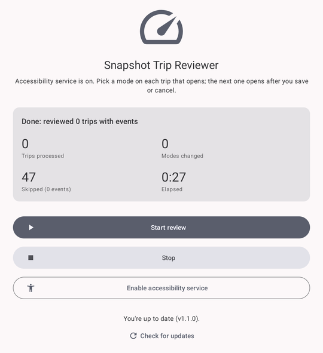
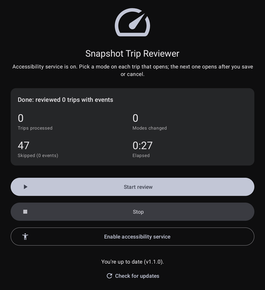
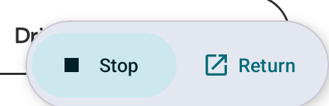
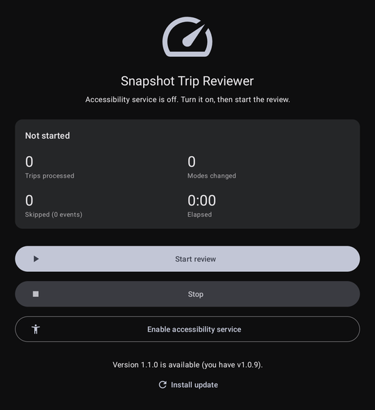

# Snapshot Trip Reviewer

Android helper for the Progressive app's Snapshot trips. It walks to **Snapshot > Trips**, scrolls the whole list, and opens the transit mode picker for every trip that has events. **You** choose the mode (Driver, Passenger, and so on) and tap Save or Cancel; the app then opens the next trip. It never selects a mode for you.

| Light | Dark | Floating controls |
| --- | --- | --- |
|  |  |  |

## How it works

An accessibility service reads the Progressive app's screen and taps its buttons. There is no root and no Progressive API involved.

- Opens Progressive, taps Snapshot, then Trips, then scrolls to the newest trip.
- Opens the transit mode picker for each trip showing more than 0 events, and waits until you save or cancel.
- Counts trips processed, modes changed, trips skipped (0 events) and elapsed time.
- Shows a floating **Stop** / **Return** pill over every app while a review runs, and brings itself to the front when the run ends.

Trips already marked Passenger or Other show no event count in Progressive, so they are neither opened nor counted as skipped.

## Install

1. Download the APK from the [latest release](../../releases/latest) and install it.
2. Open the app, tap **Enable accessibility service**, and turn on *Snapshot Trip Reviewer*.
3. Tap **Start review**.

Updates: the app checks the latest GitHub release on launch. If a newer one exists, tap **Install update**. Android asks you to allow installs from this app the first time, and Google Play Protect may warn that it hasn't seen this developer before.



## Build

```sh
./gradlew assembleDebug      # debug-signed APK
./gradlew assembleRelease    # needs keystore.properties (see below)
```

`keystore.properties` is git-ignored and holds `storeFile`, `storePassword`, `keyAlias` and `keyPassword`. Android only updates an app in place when the new APK has the same signing key, so keep the keystore backed up.

## Limits

- It finds buttons by their on-screen text. A Progressive app update that renames them will break it; the labels are the regexes at the bottom of `SnapshotService.kt`.
- Tested on one device running Android 16 with the Progressive app's English UI.
